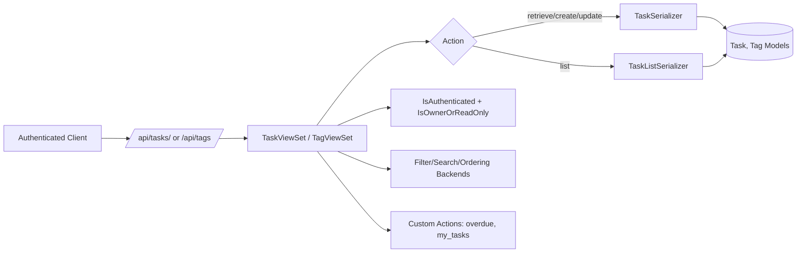

## Summary
This PR introduces a complete Django REST API foundation for task management, including data models, authenticated CRUD endpoints, filtering/search, custom task views, and automated tests. It also adds project configuration/dependencies and rewrites the README with setup and endpoint documentation.

### Key Features
| Feature | Description |
|---------|-------------|
| API Foundation | Adds Django project settings, URL routing, app registration, and required dependencies for DRF + filtering + CORS. |
| Task + Tag Domain Models | Adds `Task` and `Tag` models with status, priority, due date, ownership, M2M tags, and computed overdue state. |
| Authenticated REST Endpoints | Adds DRF `ModelViewSet` endpoints for tasks/tags, owner-aware write permissions, list/detail serializers, and custom `overdue`/`my_tasks` actions. |
| Search/Filter/Ordering/Pagination | Enables status/priority filtering, text search, ordering fields, and paginated list responses. |
| Test Coverage | Adds model and API tests for creation, ordering, auth enforcement, owner permissions, and filtering behavior. |
| Developer Documentation | Rewrites README with architecture overview, setup instructions, and endpoint reference tables. |

## Architecture


---
## Feature 1: Project + API Bootstrapping
What it does:
- Adds Django project entrypoint and base settings with installed apps for DRF, CORS, and django-filter.
- Configures global DRF pagination and default filter backends.
- Wires root API route under `/api/`.

Why this approach:
- Centralized DRF defaults keep endpoint behavior consistent across viewsets.
- Explicit dependency/config setup ensures filtering and cross-origin local development work out of the box.

Key implementation details:
- SQLite is configured as the default development database.
- CORS allows local frontend origin (`http://localhost:3000`).
- URL inclusion delegates API routing to the tasks app.

---
## Feature 2: Task and Tag Data Model
What it does:
- Introduces `Tag` with unique name and color metadata.
- Introduces `Task` with title/description/status/priority/due date/owner/tags and timestamps.
- Adds computed `is_overdue` behavior for tasks with past due dates that are not done.

Why this approach:
- Enum-like choices on status/priority provide strong constraints and predictable API values.
- M2M tags support flexible categorization without schema duplication.
- Computed overdue state avoids storing redundant data while keeping API responses user-friendly.

Key implementation details:
- `Task.owner` is a FK to `AUTH_USER_MODEL` with reverse relation `tasks`.
- Default task ordering is newest-first; tags are name-ordered.
- `Task.Priority` supports Low/Medium/High/Urgent.

---
## Feature 3: REST API Endpoints and Permissions
What it does:
- Adds `TaskViewSet` and `TagViewSet` as authenticated CRUD endpoints.
- Auto-assigns task ownership on create.
- Restricts task mutation to owners via `IsOwnerOrReadOnly`.
- Adds custom list actions:
  - `/api/tasks/overdue/` for overdue open tasks
  - `/api/tasks/my_tasks/` for current user tasks

Why this approach:
- DRF `ModelViewSet` provides consistent CRUD behavior with minimal boilerplate.
- Ownership enforcement at permission layer keeps access rules explicit and reusable.
- Separate list serializer makes list payloads lighter while preserving detail richness where needed.

Key implementation details:
- `TaskSerializer` supports writable `tag_ids` and read-only nested `tags`.
- `TaskListSerializer` is used only for list/custom list actions.
- Queryset optimization uses `select_related('owner')` + `prefetch_related('tags')`.

---
## Feature 4: Automated Tests
What it does:
- Adds model tests for task creation defaults and ordering.
- Adds API tests for create/list/update, permission boundaries, auth requirements, and status filtering.

Why this approach:
- Covers high-risk API behavior changes (authz/authn and query behavior) that commonly regress.
- Ensures default model semantics remain stable as features evolve.

Key implementation details:
- Uses `APIClient` with authenticated and unauthenticated flows.
- Verifies owner-only update enforcement returns `403` for non-owners.

---
## Feature 5: README Overhaul
What it does:
- Replaces README with complete setup instructions, feature list, stack details, and endpoint matrix.

Why this approach:
- Gives reviewers and new contributors a single source of truth for running and exploring the API.

## Files Changed
<details>
<summary>Project Configuration</summary>

- `backend/manage.py` - Django management entrypoint.
- `backend/requirements.txt` - Adds Django, DRF, CORS headers, and django-filter dependencies.
- `backend/config/__init__.py` - Initializes config package.
- `backend/config/settings.py` - Full Django + DRF + CORS + filter configuration.
- `backend/config/urls.py` - Routes `/api/` to tasks app URLs.

</details>

<details>
<summary>Tasks App Core</summary>

- `backend/tasks/__init__.py` - Initializes tasks package.
- `backend/tasks/apps.py` - App configuration.
- `backend/tasks/models.py` - `Task`/`Tag` models and overdue logic.
- `backend/tasks/serializers.py` - List/detail serializers, tag write mapping.
- `backend/tasks/views.py` - Viewsets, permissions, filtering/search/ordering, custom actions.
- `backend/tasks/urls.py` - Router registrations for tasks and tags.
- `backend/tasks/admin.py` - Admin registration for task model.

</details>

<details>
<summary>Tests and Documentation</summary>

- `backend/tasks/tests.py` - Model + API behavior tests.
- `readme.md` - End-to-end documentation rewrite.

</details>

## How to Test
```bash
cd backend
python -m venv .venv && source .venv/bin/activate
pip install -r requirements.txt
python manage.py migrate
python manage.py test tasks
```

### Manual Testing
1. Authenticate and create tasks via `POST /api/tasks/` with different priorities/status values.
2. Add tags and associate them via `tag_ids` in task create/update payloads.
3. Verify owner-only mutation by attempting to patch/delete another user's task.
4. Validate list behavior with `?status=done`, `?priority=4`, `?search=<text>`, and `?ordering=due_date`.
5. Validate custom routes `GET /api/tasks/overdue/` and `GET /api/tasks/my_tasks/`.

## Notes
- No database migration files are included in this PR.
- Working tree currently has uncommitted changes (`readme.md` modified and `.github/` untracked), which are intentionally excluded from this description.
- This description reflects committed changes only from `origin/main...HEAD`.
